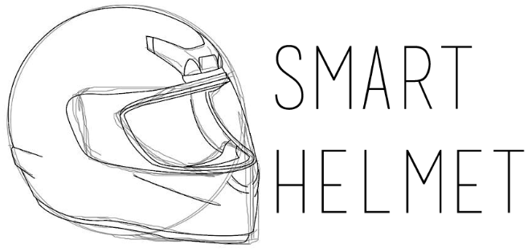
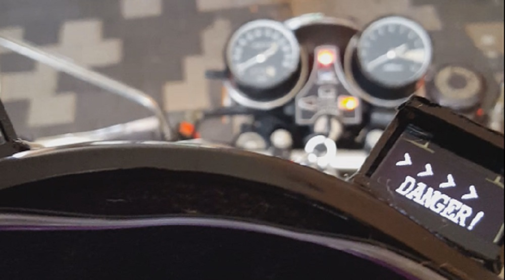

# SmartHelmet

Wireless heads-up-display for motorcycle helmets to detect collisions, warning the driver to avoid the collision before it happens.

Completed in 2017 at the University of Central Florida.

# Documents

[Summary Presentation PDF](_readme_media/SmartHelmet_PPT.pdf)

[Conference Paper](_readme_media/SmartHelmet_ConferencePaper.pdf)

[Technical Documentation](_readme_media/SmartHelmet_Documentation.pdf)

## About

The Smart Helmet is a motorcycle add-on kit that uses proximity sensors and a heads-up-display on the driver's helmet to unobtrusively warn the driver of potentially deadly hazards lurking in blind spots.

It does this by using proximity sensors to scan an area behind the rider and gather proximity information of surrounding objects to determine if other vehicles or hazards are close by. The system will wirelessly sent this data to the helmet module to be displayed in a heads-up-display.

## Credits

- Blake Scherschel - Core software and wireless connectivity
- Julian Bonnells - Wireless display and reliability
- Jorge De Gouveia - Wireless display and supporting tooling
- Jeremy Reimers - Battery power controls
